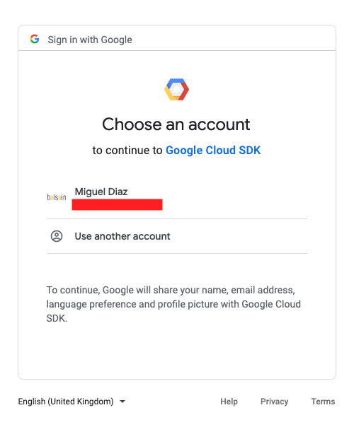
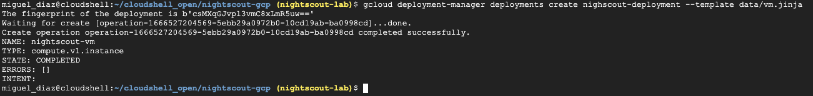

# Desplegar nightscout

## Introduccion
A continuación mostraremos los pantallazos del flujo

Next we will show the screenshots of the flow

## Flujo de Login/Login Flow

Acceso login/Login

Url/URL

Selección de usuario/ Select User

Autorizar/Authorize

Contraseña/Password

Usar contraseña/Use Password

## Flujo de Configuración de proyecto

Configurar proyecto/Setting project

## Flujo de Desplegar máquina

Desplegar/Deploy

