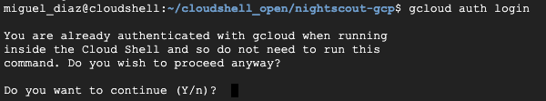
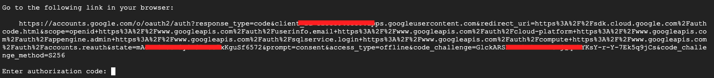
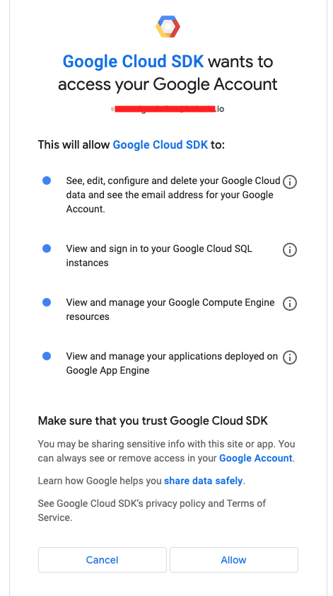
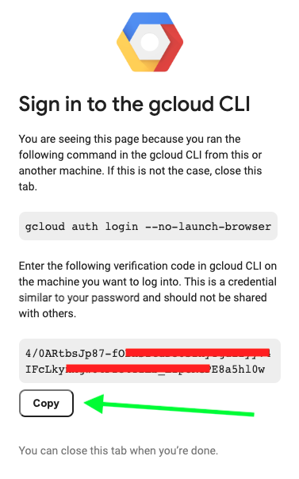
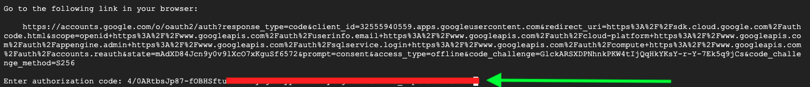

# Desplegar nightscout

## Introduccion
A continuación mostraremos los pantallazos del flujo

## Flujo de Login

Acceso login

Url

Selección de usuario

Autorizar

Contraseña

Usar contraseña

## Flujo de Configuración de proyecto

Configurar proyecto

## Flujo de Desplegar máquina

Desplegar

